## Project A2: Predicting Car Price

## Overview

The project's primary objective is to develop a predictive model to determine the selling prices of cars, culminating in a user-friendly, web-based price prediction system.

## Dataset and Features


### Dataset Description

The dataset provided contains various features related to cars, including:

**Name:** Brand name of the car.
**Year:** Year of manufacture.
**Selling Price:** Price at which the car is being sold.
**Km Driven:** Total kilometers driven by the car.
**Fuel:** Type of fuel used by the car.
**Seller Type:** Type of seller (Individual, Dealer, etc.).
**Transmission:** Transmission type of the car (Manual, Automatic).
**Owner:** Number of previous owners.
**Mileage:** Car's mileage.
**Engine:** Size of the engine.
**Max Power:** Maximum power of the car.
**Torque:** Torque of the engine.
**Seats:** Number of seats in the car.

## Preprocessing

The raw data requires specific preprocessing steps which are outlined in the notebook.

## Libraries Used

Numpy
Pandas
Seaborn
Matplotlib
Scikit-learn

## Notebook Contents

Introduction and Dataset Description
Library Importation
Data Preprocessing and Exploration
Model Development and Evaluation
Conclusion and Recommendations for Deployment


## Data Preprocessing
Key preprocessing steps include dummy encoding for categorical variables, ensuring compatibility with machine learning algorithms.

## Exploratory Data Analysis (EDA)

The EDA process involved both univariate and multivariate analyses, leveraging tools like Seaborn for visualizing and understanding the data distribution and relationships between variables.

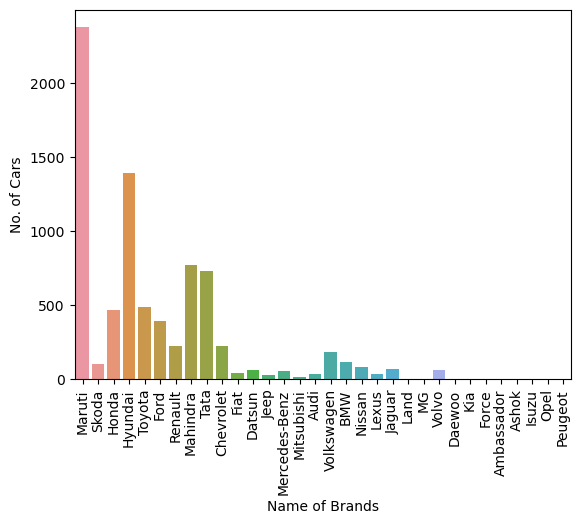
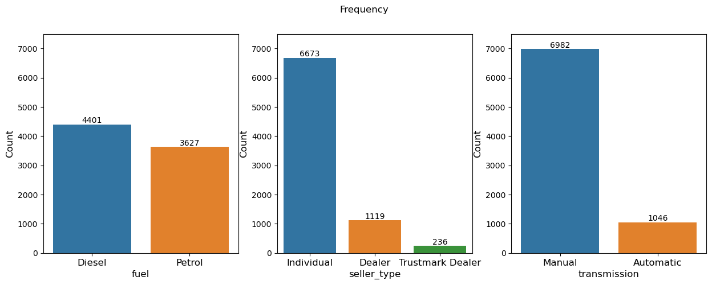
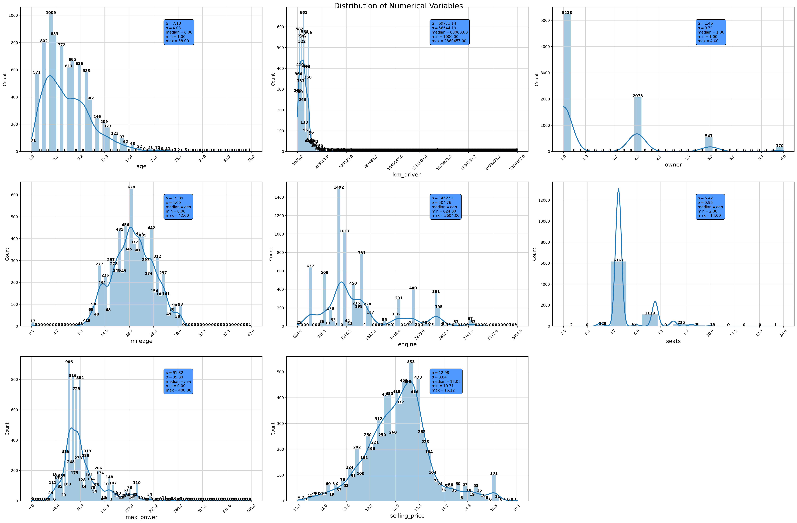
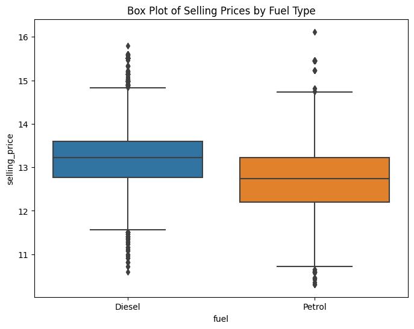
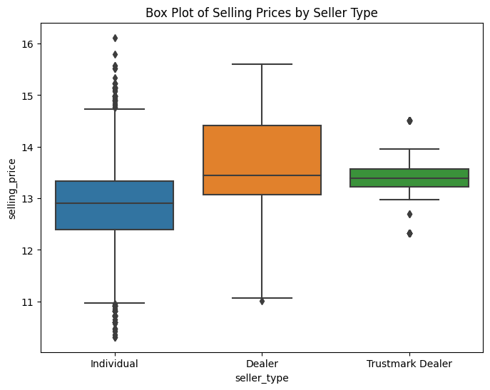
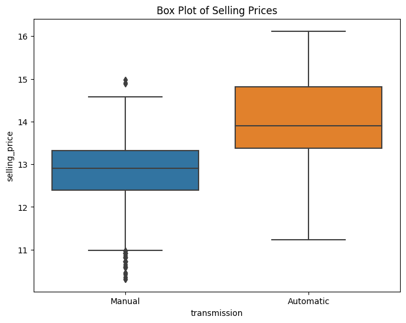


## Predictive Power Score
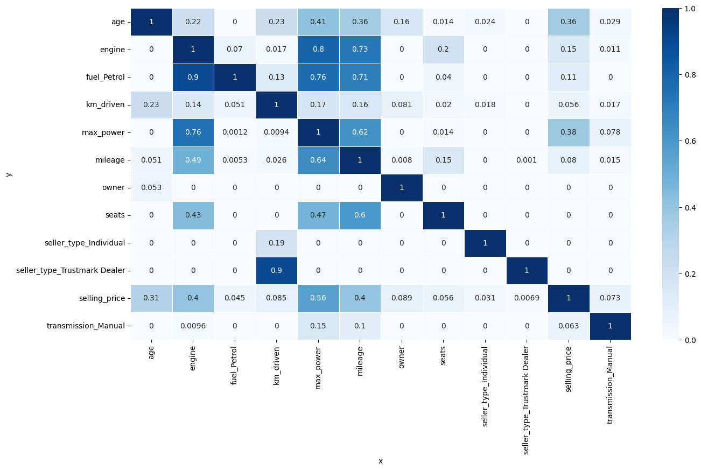

Age:

Has a PPS of 0.36 with respect to selling_price, suggesting a moderate predictive relationship where the age of a car can help predict its selling price.

Engine:

Has a significant PPS of 0.8 with max_power, indicating that the size of the engine is highly predictive of the car's power output.

Fuel_Petrol:

Shows a PPS of 0.9 with engine, which is expected.

Km_Driven:

Has a low PPS with respect to selling_price (0.05), suggesting it is not a strong predictor of the selling price on its own.

Max_Power:

Shows a PPS of 0.38 with selling_price, indicating a reasonably strong predictive power on the selling price.
Has a PPS of 0.76 with engine, further confirming the strong relationship between engine size and max power.

Milage: 

Show low PPS of 0.08 with selling_price

Seats:

Shows a good predictive relationship with engine (0.43), indicating that the number of seats might predict the engine size, possibly due to larger cars with more seats having bigger engines.

Seller_Type (Individual and Trustmark Dealer):

Both show low PPS scores with respect to selling_price, suggesting that seller type might not be a strong predictor of selling price in isolation.


##  Feature Selection

Important features for the model were chosen based on their predictive power and relevance to the selling price, including factors like kilometers driven, max power, age, fuel and engine size.


## Model Development and Evaluation
### Metric 

* **Mean Squared Error** (MSE) and **R^2**  are used as metrice.

* MSE measures the average squared difference between the predicted and actual values. It gives us an idea of how close the predicted values are to the actual values. Lower MSE indicates better model performance.

* R^2 is a value between 0 and 1 where
     - 0 inidicates model does not explain any of the variability in the target variable.
     - 1 indicate that the model perfectly explains the variability in the target variable.

We check the following each of the combination - 
```

regs = ["Polynomial", "Lasso", "Ridge", 'Normal']
init_thetas = ['zero', 'xavier']
methods = ['batch', 'sto', 'mini']
momentums = [0, 0.9]
lr_li = [0.01, 0.001]
num_random_searches = 10


```
We found the **Normal Linear Regression Model** works better in our case with  below configuratrion- 
 - Method: stochastic 
 - Momentum: 0 
 - Theta Init: xavier 
 - Learning Rate: 0.01
 
 The choosen model's Accuracy- 
  - MSE 0.096
  - R^2 0.85


#### Some of the runs from MLFLOW and the comparison of various runs with their test mse and r^2 scores
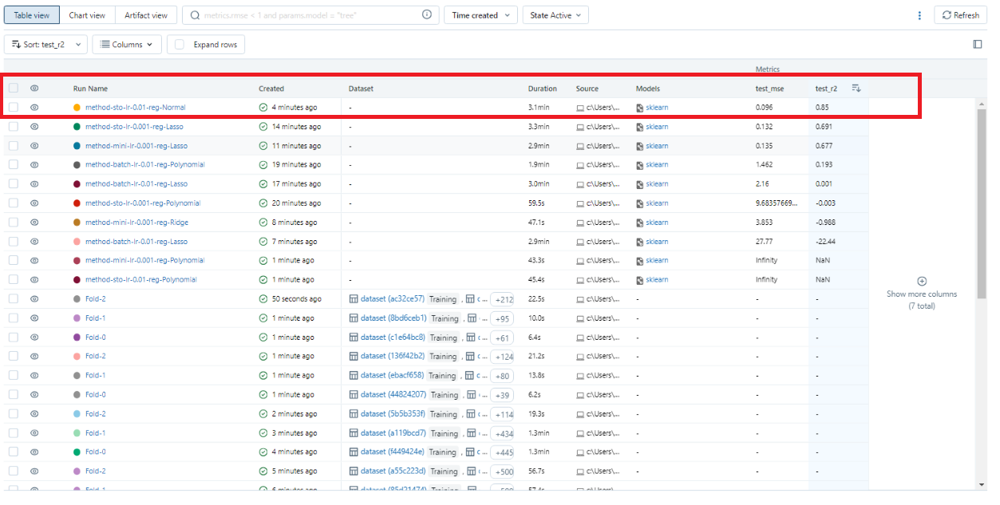

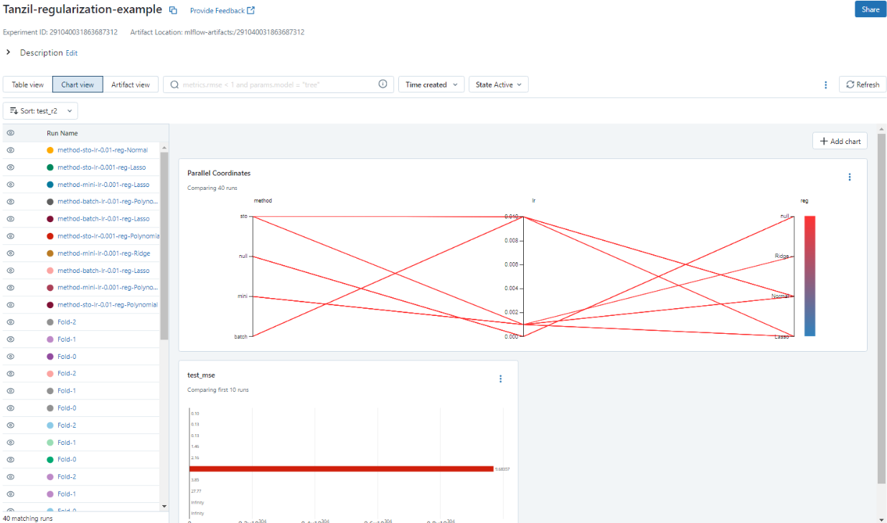


## Environment Setup


To set up the environment for running the car selling price prediction Assignment, follow these steps:
 1. Install Python: Ensure  Python version 3.8.17 or above
 2. Install Required Packages
 ```pip install numpy==1.25.2
    pip install pandas==1.5.3
    pip install seaborn==0.12.2
    pip install matplotlib==3.7.2
    pip install scikit-learn==1.3.2
    pip install dash
    pip install dash_bootstrap_components
    pip install mlflow
```

### Dash App Deployment 

All the files reqiured for setting up Dash deployment are in ```app/code``` directory. Dash Application contains 2 models ( one from Assignment A1 and current One). User are flexible to choose any of them. Need to open the terminal and navigate to the directory ```app/code```. Finally run the below command.

 ```
 python main.py
 ```

 Then, access the Dash Application: Once the script is running, open a web browser and visit **http://localhost:9001/**  to access the web application.


 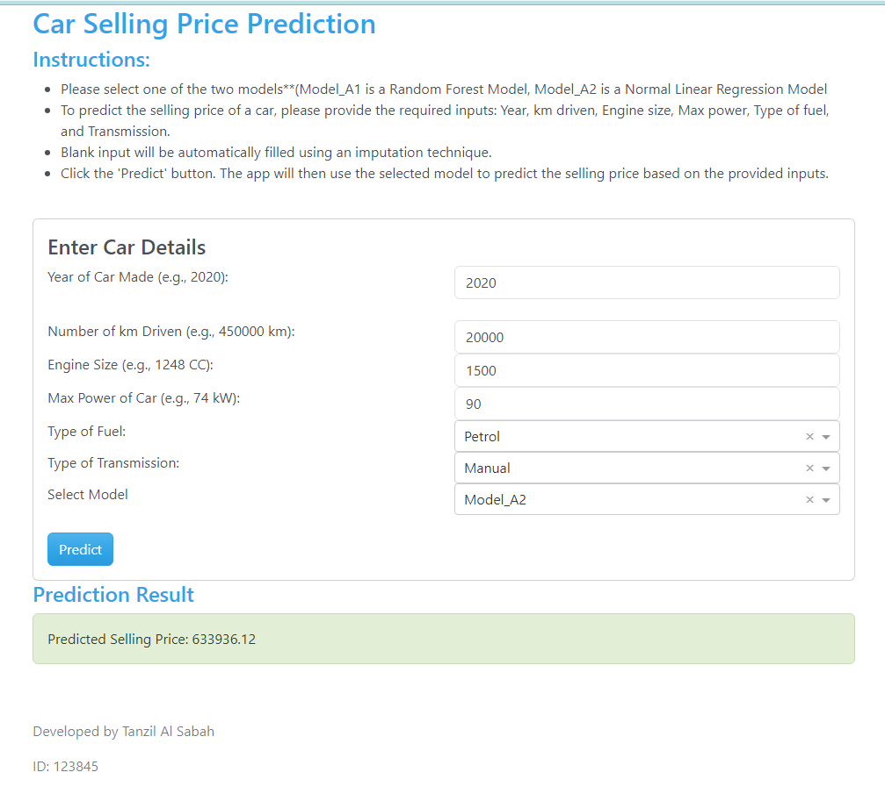

 ### Docker Compose to run the app in a Docker container
Need to open terminal or command prompt and navigate to ```app`` directory where the docker-compose.yml and Dockerfile are located. And run the below command 


``````sh
docker compose up --build

```````

Access the app with **http://localhost:9001**


## Deployment on AIT ML2023 Server


 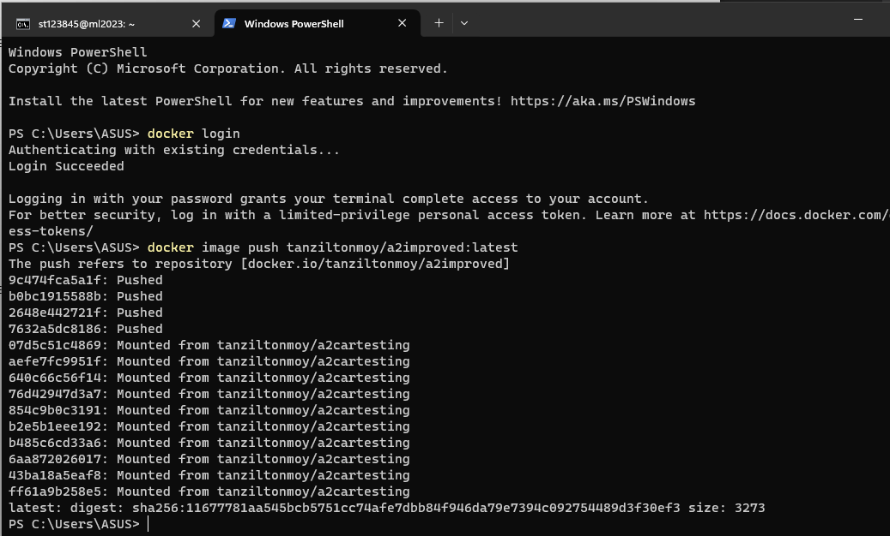
  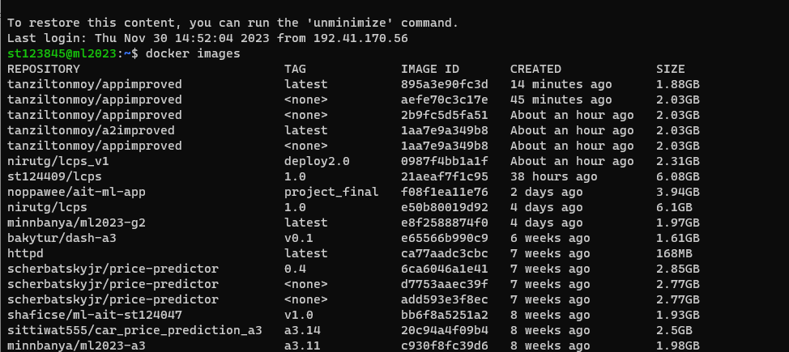


#### For a live demo please visit **https://web-st123845.ml2023.cs.ait.ac.th/**


Conclusion and Recommendations


## Model Selection Findings

The chosen model configuration is characterized by several key features:

Regularization Type: The model uses "Normal" regularization. This implies a traditional approach without L1 (Lasso) or L2 (Ridge) penalties.

Optimization Method: Stochastic Gradient Descent (SGD).

Momentum: Momentum aspect of SGD is not utilized.

Weight Initialization: Xavier initialization is used for setting the initial weights of the model, a common choice for deep learning models.

Learning Rate: The learning rate is set to 0.01, a standard starting point for many models.

## Recommendations for Future Improvements

To further enhance the model's performance, several strategies can be considered:

Extended Hyperparameter Tuning: A more exhaustive or refined search over hyperparameters like regularization strength and learning rate can lead to improved model accuracy. Techniques like grid search, random search, or Bayesian optimization can be utilized for this purpose.

Advanced Feature Engineering: Implementing more sophisticated feature engineering techniques could uncover deeper insights from the data. This might include creating interaction terms, polynomial features, or extracting new features from existing data.

## Error 

The model doesnt work well for the feature transmission when it is set to Automatic, In later improvement, we will try to fix that.

